<div align="center">


# TsaoSciComputation

**Evidence-bound scientific-computation orchestration from electrons to industrial processes.**

   

[中文说明](README.zh-CN.md) · [Root Skill](SKILL.md) · [Capabilities](capability-index/README.md) · [Coverage](docs/coverage-matrix.md) · [Scientific validation](docs/scientific-validation.md) · [Confidence](docs/scientific-confidence.md) · [Architecture](docs/architecture.md) · [Releases](docs/release.md) · [Security](SECURITY.md)

</div>

## What it is

TsaoSciComputation converts a scientific question into a traceable calculation program with explicit contracts, method and scale routing, environment preflight, bounded execution, conservative parsing, numerical and physical validation, uncertainty, applicability, provenance, and acceptance gates.

```text
question → contract → route → preflight → execute → parse
         → converge → validate → quantify uncertainty → accept or reject
```

It is an **orchestration and governance layer**. It does not bundle, redistribute, unlock, or impersonate external solvers, licenses, databases, basis sets, pseudopotentials, private data, or production HPC infrastructure.

## Architecture at a glance

<table>
<tr>
<td width="50%"></td>
<td width="50%"></td>
</tr>
<tr>
<td align="center"><b>Governed scientific agent</b><br>Planning, routing, execution, evidence and review remain separate.</td>
<td align="center"><b>Contract-based capability system</b><br>164 differentiated capabilities are organized through 20 workflows.</td>
</tr>
</table>

The core design is fail-closed:

- a declared adapter is not automatically available;
- a normal process exit is not automatically parsed or converged;
- a converged result is not automatically physically valid;
- a validated observable is not automatically applicable outside its domain;
- a high-risk engineering conclusion is not automatically authorized.

## Multiscale scientific workflows

<table>
<tr>
<td width="50%"></td>
<td width="50%"></td>
</tr>
<tr>
<td align="center"><b>Quantum → molecular</b><br>Electronic structure, parameterization, ensembles and validated observables.</td>
<td align="center"><b>Polymer → process</b><br>Sequence, morphology, continuum fields and process-system handoffs.</td>
</tr>
</table>

Representative scope includes electronic structure, quantum chemistry, atomistic and enhanced-sampling workflows, machine-learned potentials, mesoscale and continuum models, reaction engineering, CFD, multiphysics, process simulation, optimization, uncertainty, reproducibility and multiscale handoff.

## Domain capability views

<table>
<tr>
<td width="50%"></td>
<td width="50%"></td>
</tr>
<tr>
<td align="center"><b>Electronic structure &amp; DFT</b><br>Geometry, density, self-consistency, energy, forces and observable-level acceptance.</td>
<td align="center"><b>CFD, FEM &amp; multiphysics</b><br>Mesh quality, conservation, coupled fields, stability and discretization evidence.</td>
</tr>
</table>


The process layer separates flowsheet construction, model calibration, uncertainty propagation, sensitivity, constrained search and human authorization. A numerical optimum is rejected when feasibility, uncertainty, safety, applicability or review evidence is incomplete.

## Specialized simulation and AI capability atlas

<table>
<tr>
<td width="50%">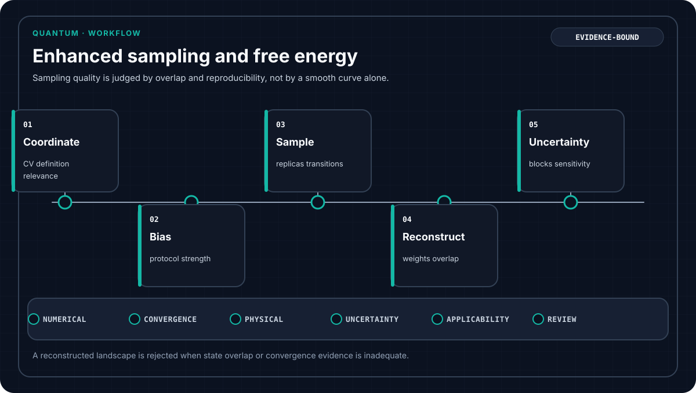</td>
<td width="50%">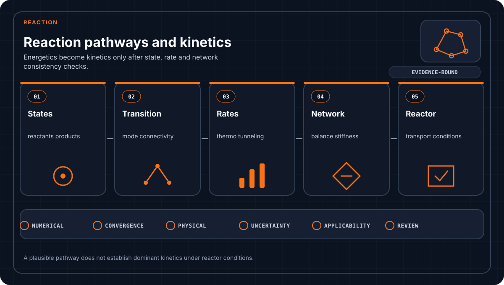</td>
</tr>
<tr>
<td align="center"><b>Enhanced sampling &amp; free energy</b><br>Collective variables, biased ensembles, overlap, reconstruction and uncertainty.</td>
<td align="center"><b>Reaction pathways &amp; kinetics</b><br>Stationary points, transition states, rates, networks and reactor-balance handoff.</td>
</tr>
<tr>
<td width="50%">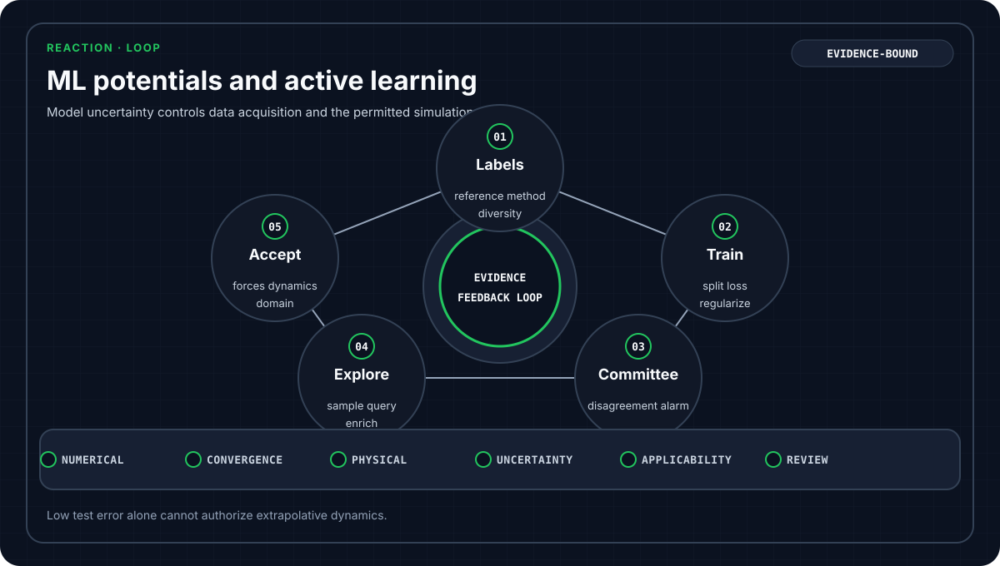</td>
<td width="50%">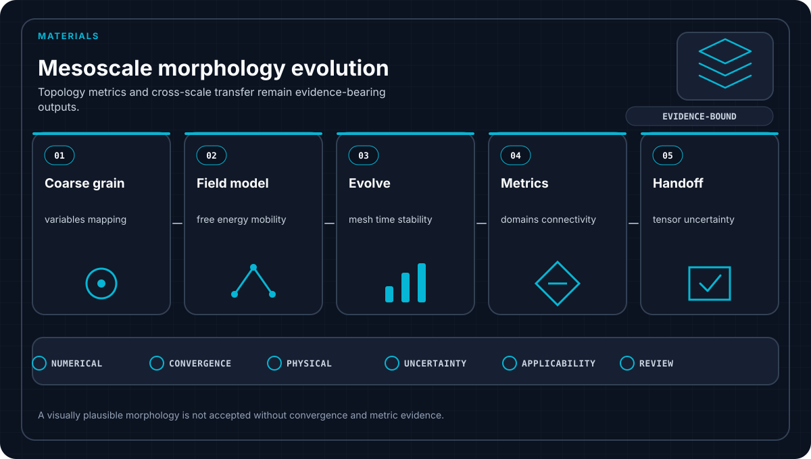</td>
</tr>
<tr>
<td align="center"><b>ML potentials &amp; active learning</b><br>Reference labels, model committees, uncertainty alarms and validated dynamics.</td>
<td align="center"><b>Mesoscale morphology</b><br>Coarse-graining, phase evolution, topology metrics and continuum transfer.</td>
</tr>
<tr>
<td width="50%">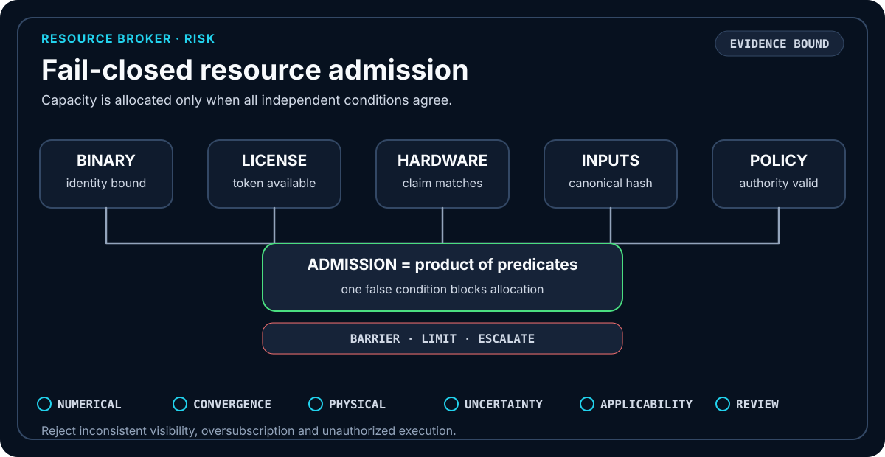</td>
<td width="50%">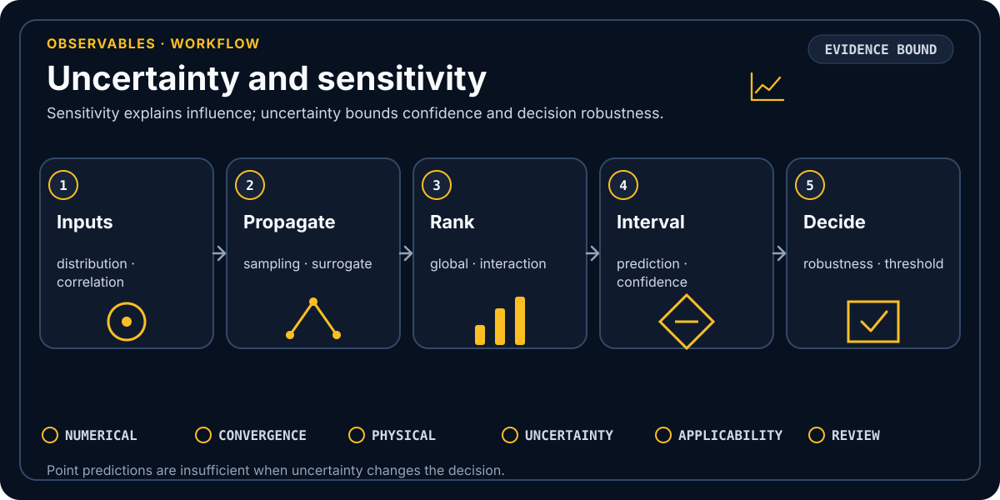</td>
</tr>
<tr>
<td align="center"><b>HPC execution provenance</b><br>Preflight, scheduler boundaries, isolated execution, hashes and reviewed evidence.</td>
<td align="center"><b>UQ &amp; sensitivity</b><br>Input distributions, propagation, global ranking, prediction intervals and robust decisions.</td>
</tr>
</table>

These views make six high-impact capability families explicit without claiming bundled solvers or live production execution. Each diagram separates numerical output from convergence, physical validity, uncertainty, applicability and human authorization.

## Systems, observables and governance atlas

<table>
<tr>
<td width="50%">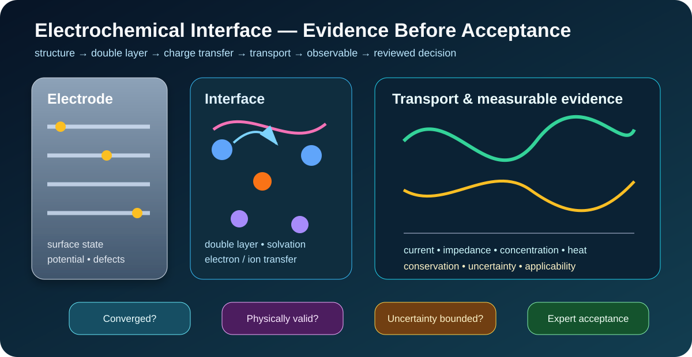</td>
<td width="50%">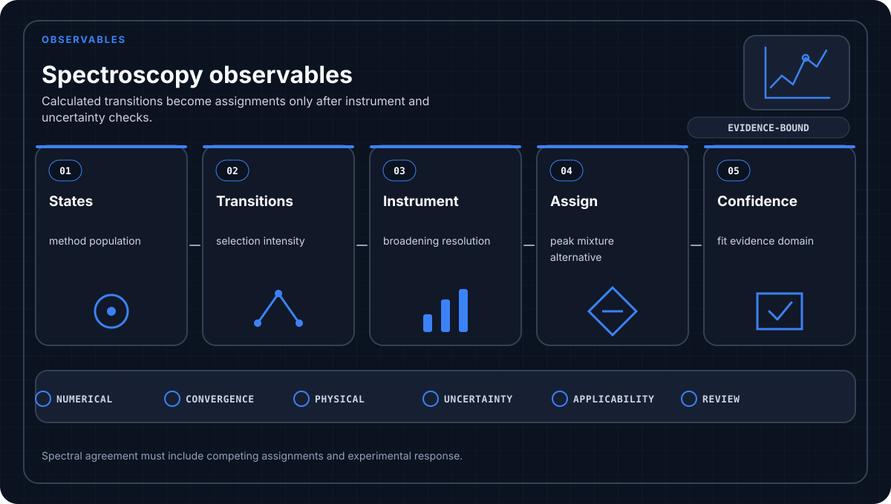</td>
</tr>
<tr>
<td align="center"><b>Electrochemical interfaces</b><br>Surface state, double layer, charge transfer, transport and measurable evidence.</td>
<td align="center"><b>Spectroscopy observables</b><br>State models, transition rules, instrument response, assignment and confidence.</td>
</tr>
<tr>
<td width="50%">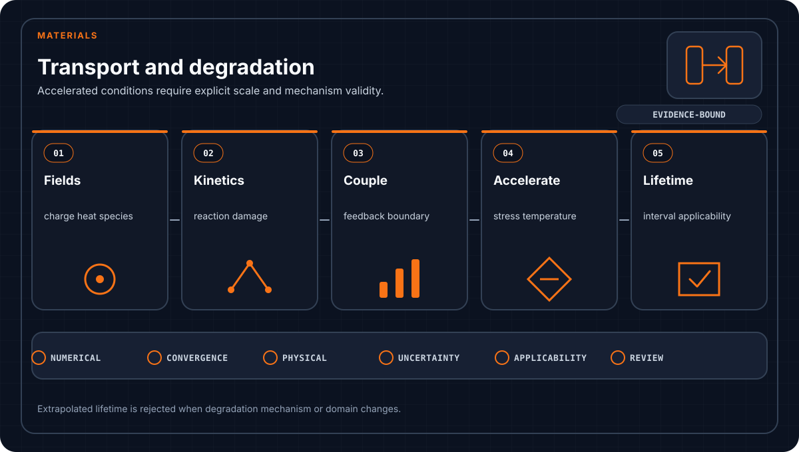</td>
<td width="50%">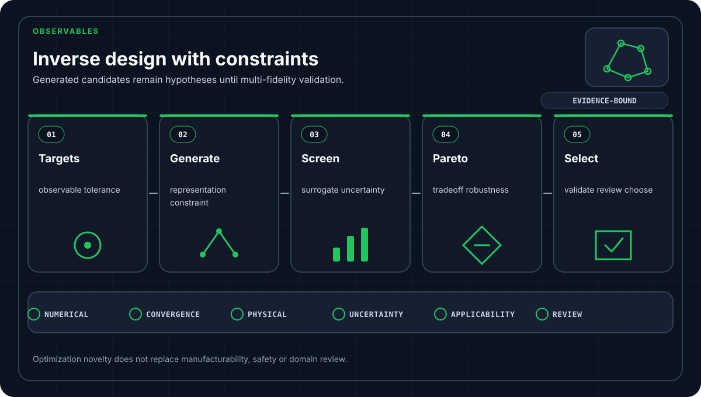</td>
</tr>
<tr>
<td align="center"><b>Transport &amp; degradation</b><br>Charge, heat and species coupling, damage kinetics and bounded lifetime evidence.</td>
<td align="center"><b>Inverse design</b><br>Traceable targets, constrained generation, multi-fidelity Pareto validation and human choice.</td>
</tr>
<tr>
<td width="50%">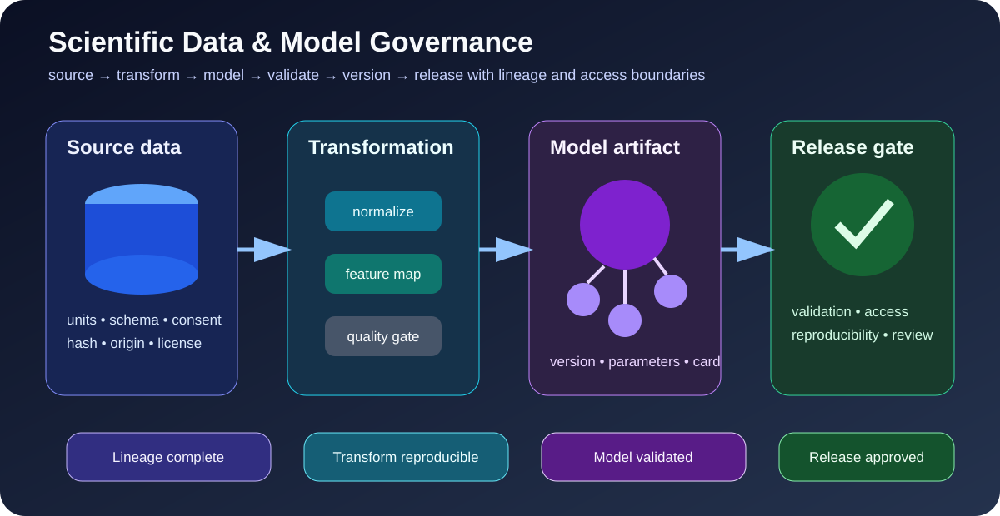</td>
<td width="50%">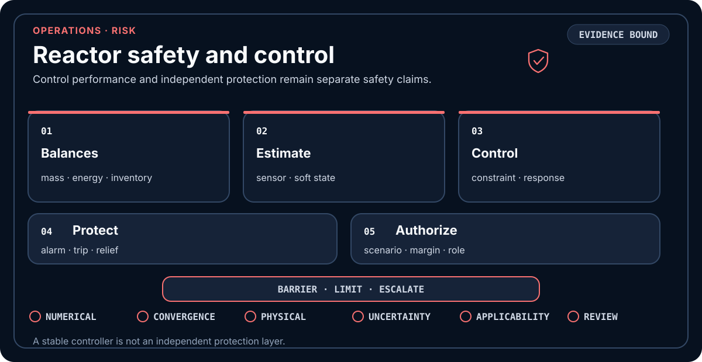</td>
</tr>
<tr>
<td align="center"><b>Data &amp; model governance</b><br>Lineage, transformations, versioned artifacts, access controls and release gates.</td>
<td align="center"><b>Reactor safety &amp; control</b><br>Balances, state estimation, independent protection layers and qualified authority.</td>
</tr>
</table>

These six views extend the atlas from computational methods into measurement, lifecycle, governance and safety. They explain what evidence must exist before a scientific result can support a design, operational or engineering decision.

<!-- V5_VISUAL_ATLAS:START -->
## Materials, manufacturing and model-lifecycle atlas

<table>
<tr>
<td width="50%">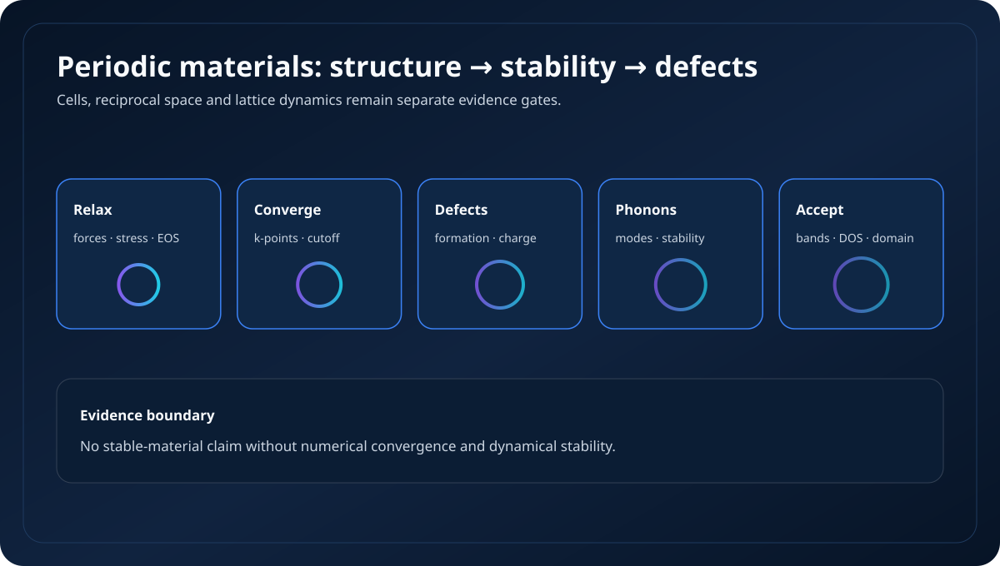</td>
<td width="50%">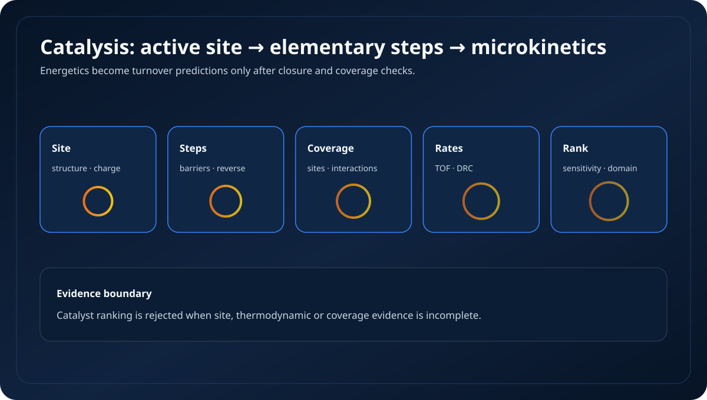</td>
</tr>
<tr>
<td align="center"><b>Periodic materials</b><br>Relaxation, convergence, defects, phonons and observable-level acceptance.</td>
<td align="center"><b>Catalysis &amp; microkinetics</b><br>Sites, elementary steps, coverage, rates and bounded catalyst ranking.</td>
</tr>
<tr>
<td width="50%">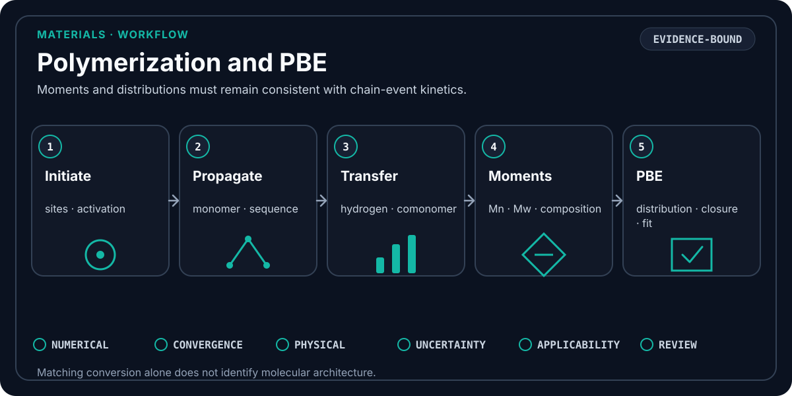</td>
<td width="50%">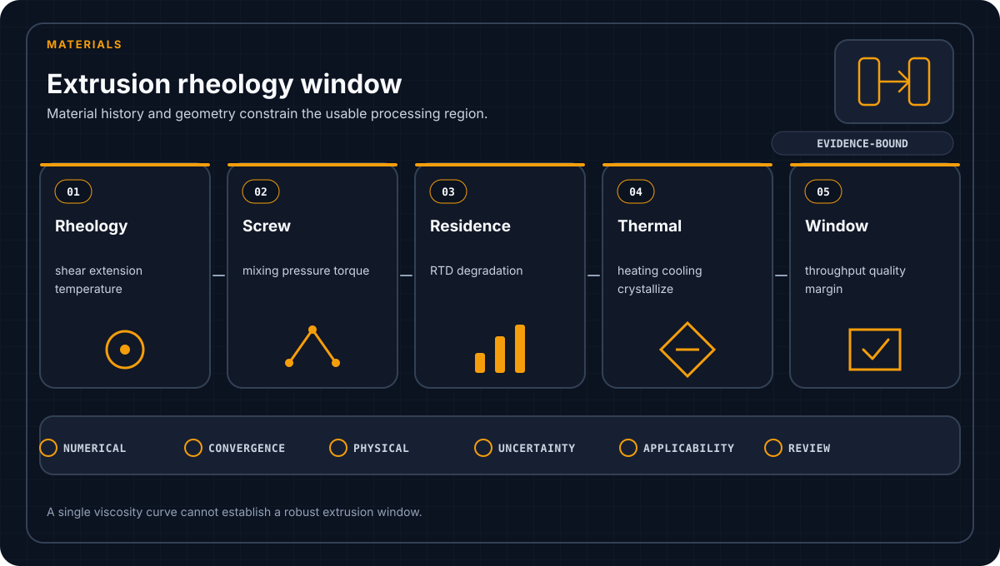</td>
</tr>
<tr>
<td align="center"><b>Polymerization &amp; PBE</b><br>Elementary events, moments, molecular distributions, identifiability and scale handoff.</td>
<td align="center"><b>Extrusion rheology</b><br>Constitutive laws, screw/die flow, RTD, thermal history and product quality.</td>
</tr>
<tr>
<td width="50%">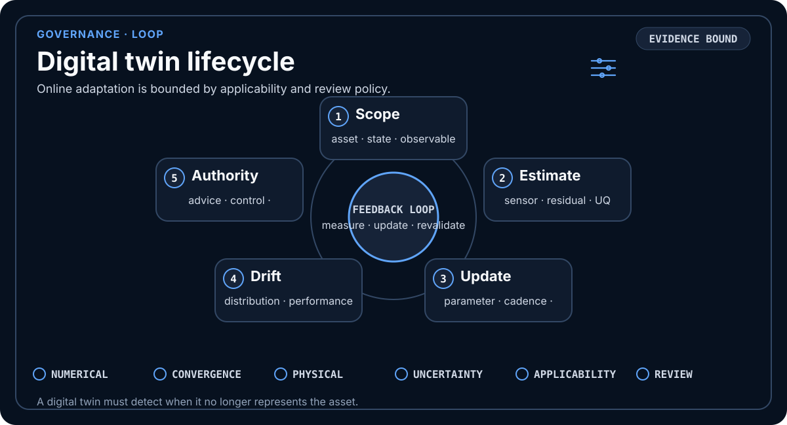</td>
<td width="50%">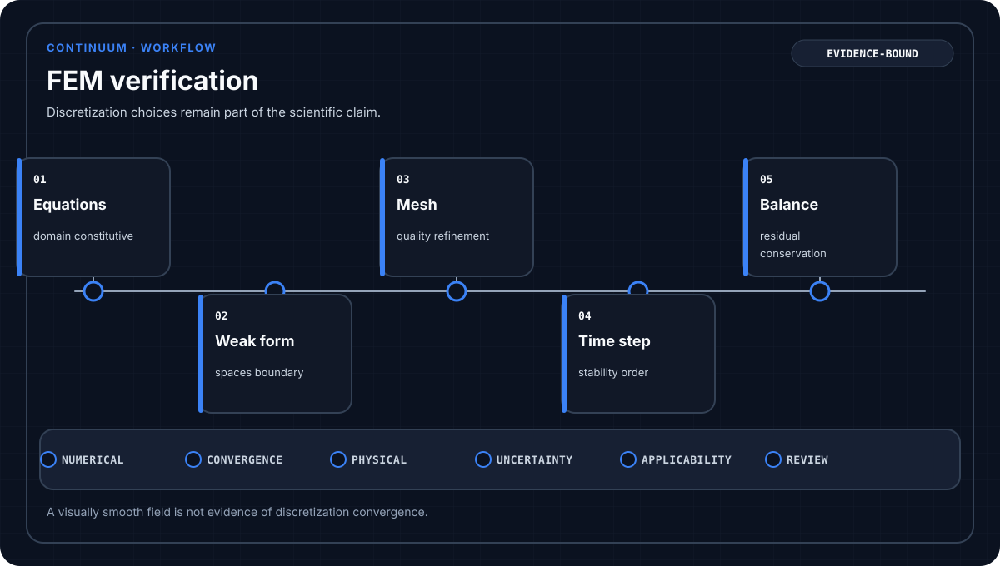</td>
</tr>
<tr>
<td align="center"><b>Digital twin lifecycle</b><br>Scope, estimation, online updates, drift, applicability and human authority.</td>
<td align="center"><b>FEM verification</b><br>Governing equations, weak forms, mesh/time-step convergence and balance evidence.</td>
</tr>
</table>

These views expose six implemented capability families that were previously present in the registry but not independently visualized. Each keeps numerical completion separate from scientific acceptance.
<!-- V5_VISUAL_ATLAS:END -->

<!-- V6_VISUAL_ATLAS:START -->
## Planning, molecular and cross-scale capability atlas

<table>
<tr>
<td width="50%">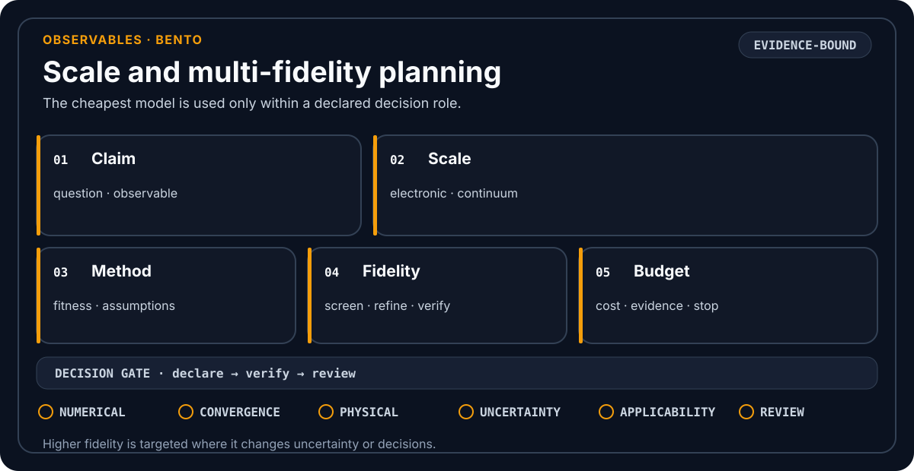</td>
<td width="50%">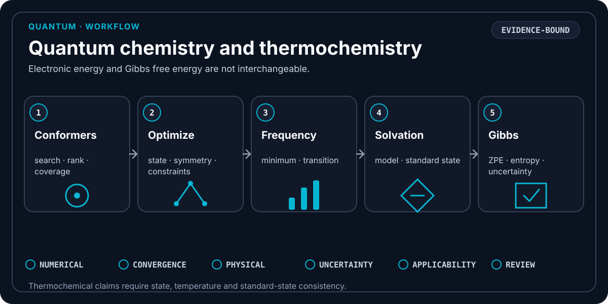</td>
</tr>
<tr>
<td align="center"><b>Scale and multi-fidelity planning</b><br>Claims, scale boundaries, method fitness, fidelity ladders and evidence budgets.</td>
<td align="center"><b>Quantum chemistry and thermochemistry</b><br>Structures, frequencies, energies, solvation, thermal corrections and pathways.</td>
</tr>
<tr>
<td width="50%">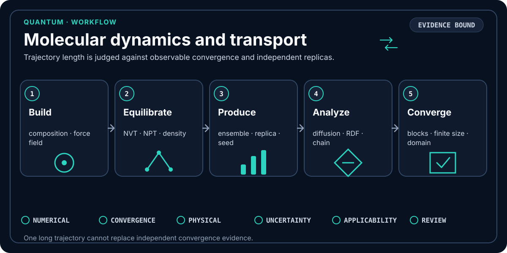</td>
<td width="50%">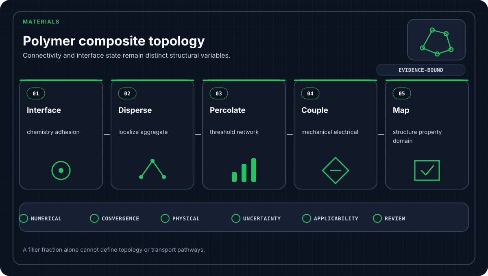</td>
</tr>
<tr>
<td align="center"><b>Molecular dynamics and transport</b><br>System qualification, ensembles, production sampling, observables and convergence.</td>
<td align="center"><b>Polymer composite topology</b><br>Interfaces, localization, dispersion, percolation and bounded property maps.</td>
</tr>
<tr>
<td width="50%">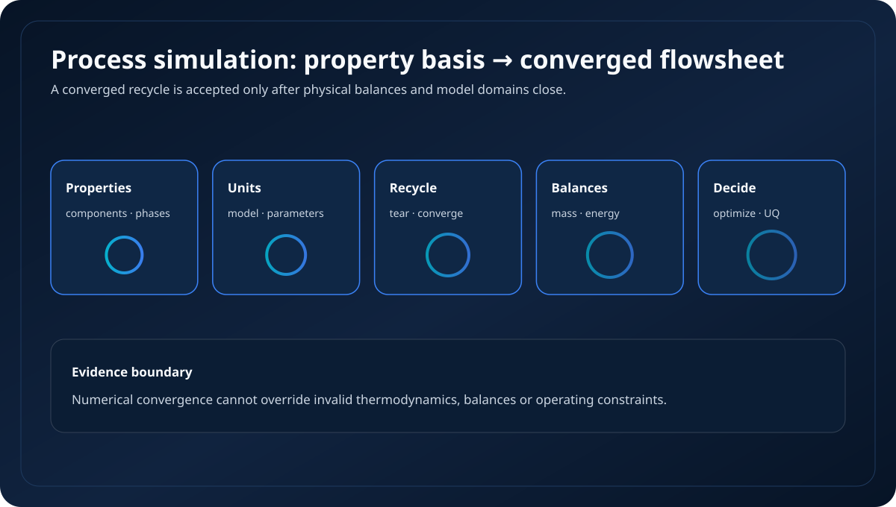</td>
<td width="50%">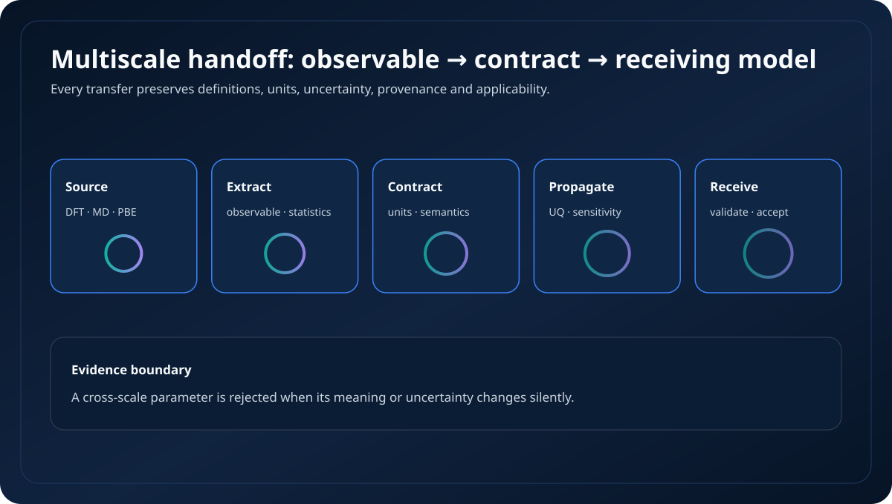</td>
</tr>
<tr>
<td align="center"><b>Flowsheet convergence and balances</b><br>Properties, units, recycle closure, balances, optimization and uncertainty.</td>
<td align="center"><b>Multiscale handoff and uncertainty</b><br>Observable semantics, units, provenance, uncertainty and receiving-model acceptance.</td>
</tr>
</table>

These six views expose implemented capability families that were previously distributed across the registry but lacked dedicated visual explanations. They do not claim bundled solvers or live production execution.
<!-- V6_VISUAL_ATLAS:END -->

<!-- V7_VISUAL_ATLAS:START -->
## Molecular states, transport and operational-resilience atlas

<table>
<tr>
<td width="50%">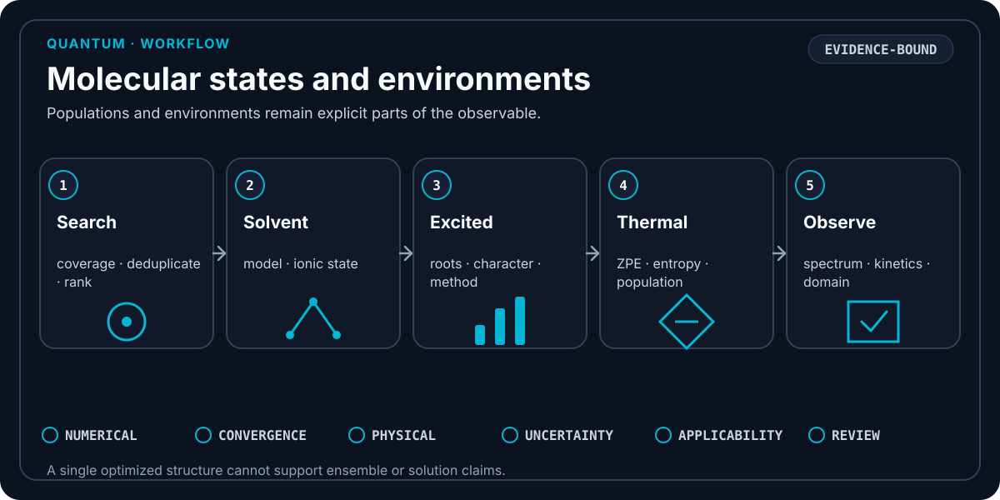</td>
<td width="50%">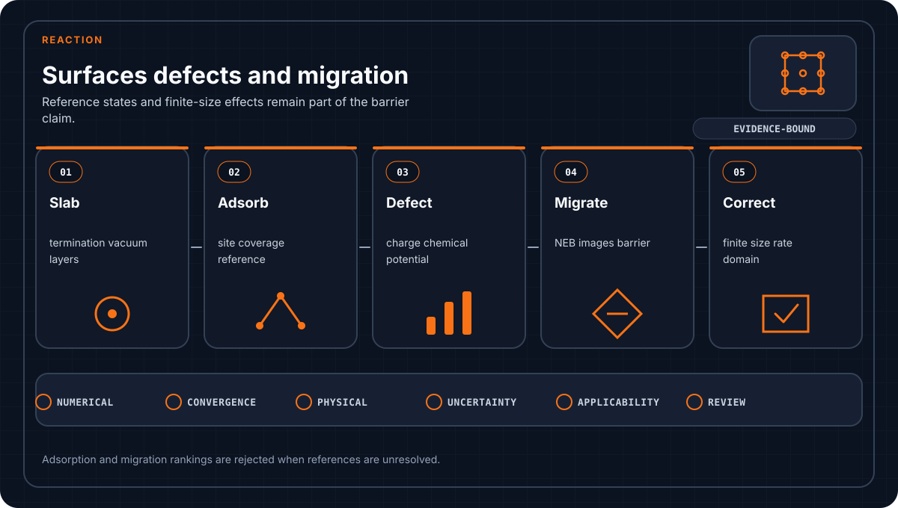</td>
</tr>
<tr>
<td align="center"><b>Molecular states and environments</b><br>Conformers, solvation, excited states, thermal corrections and population-aware observables.</td>
<td align="center"><b>Surfaces, defects and migration</b><br>Surface models, adsorption references, charged defects, pathways and correction evidence.</td>
</tr>
<tr>
<td width="50%">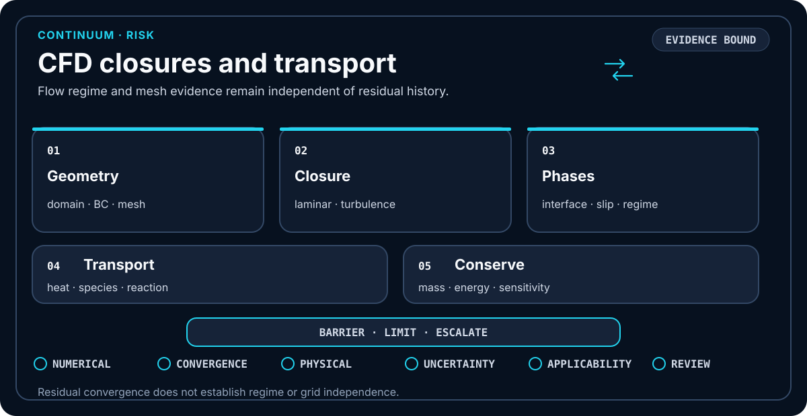</td>
<td width="50%">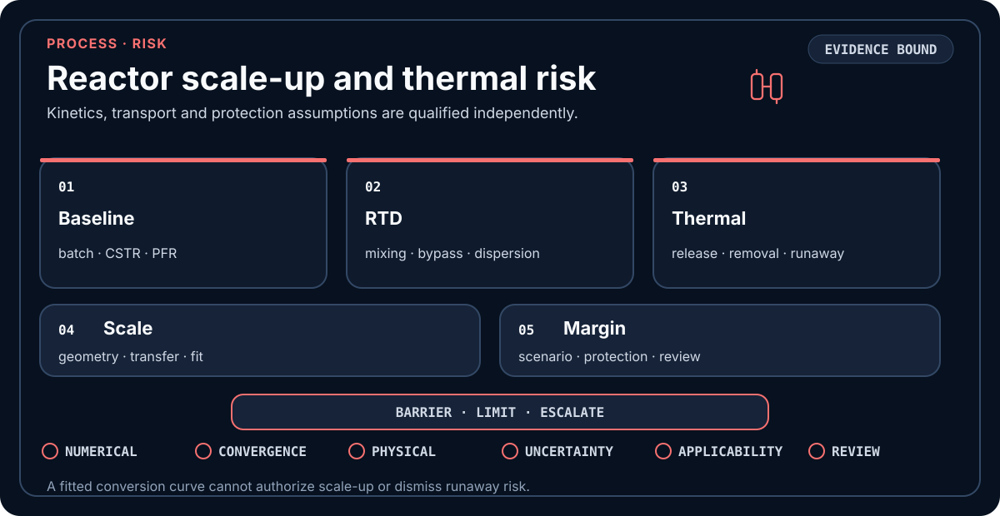</td>
</tr>
<tr>
<td align="center"><b>CFD closures and transport</b><br>Turbulence, multiphase regimes, heat/species coupling, mesh evidence and conservation.</td>
<td align="center"><b>Reactor scale-up and thermal risk</b><br>Ideal baselines, RTD, heat removal, runaway scenarios and qualified scale transfer.</td>
</tr>
<tr>
<td width="50%">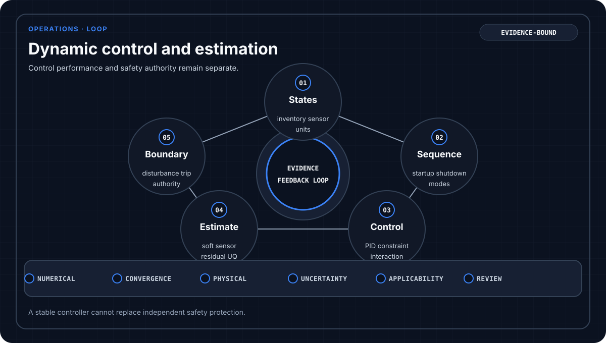</td>
<td width="50%">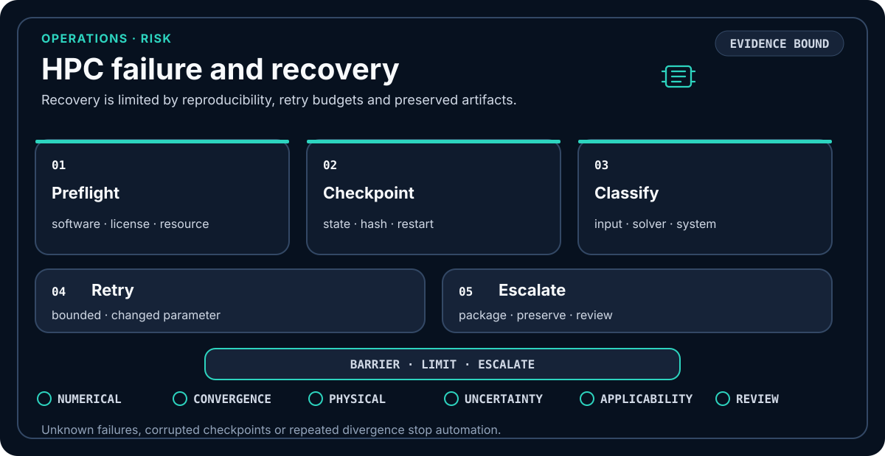</td>
</tr>
<tr>
<td align="center"><b>Dynamic control and estimation</b><br>Inventories, operating sequences, control structures, disturbances and safety authority.</td>
<td align="center"><b>HPC failure and recovery</b><br>Preflight, scheduler evidence, checkpoints, failure classes and bounded retries.</td>
</tr>
</table>

These six views make additional implemented capability families explicit while retaining strict boundaries between numerical completion, scientific validity, operational safety and human authorization.
<!-- V7_VISUAL_ATLAS:END -->

## Solver-aware ecosystem


The repository contains 27 conservative adapter definitions. Of 32 engines in the source shortlist, 21 are represented directly or through combined adapters; 11 remain explicit non-standalone limits. Adapter discovery requires every declared executable and Python module. `live_execution_verified` remains false unless independent live-solver evidence exists.

See the [coverage matrix](docs/coverage-matrix.md), [adapter certification](docs/adapter-certification.md), and individual `adapters/*/ADAPTER.md` records for exact boundaries.

## Evidence, confidence and reproducibility

<table>
<tr>
<td width="50%"></td>
<td width="50%"></td>
</tr>
<tr>
<td align="center"><b>Acceptance loop</b><br>Contract, execution, convergence, physics, uncertainty and domain checks.</td>
<td align="center"><b>C0–C5 confidence</b><br>Stronger claims require stronger evidence; C5 is explicit-only.</td>
</tr>
</table>


Every governed handoff can retain inputs, units, methods, versions, paths, seeds, tolerances, raw and parsed artifacts, validation results, hashes and release evidence. Reproducibility is tested through independent source-archive and Wheel rebuilds rather than inferred from documentation.

## Quick start

```bash
git clone https://github.com/SUNHAOJUN22/TsaoSciComputation.git
cd TsaoSciComputation
python -m pip install -e .

python -m tsao_computation route "Use DFT and MD to study a polymer interface"
python scripts/init_project.py --root demo --name demo \
  --question "How does morphology affect conductivity?"
python -m tsao_computation validate-contract \
  templates/calculation-contract.json --strict
python -m tsao_computation probe
```

External solvers are optional and must be installed, licensed and validated separately. Missing executables, malformed contracts, unsafe paths, illegal state transitions or incomplete evidence are rejected rather than silently accepted.

<!-- PERFORMANCE_V9:START -->
## Performance engineering

V9 measures the accepted V8 baseline and the candidate on the same runner before accepting any efficiency claim. Deterministic audit run `30232461778` recorded:

| Measured path | V8 baseline | V9 candidate | Result |
|---|---:|---:|---:|
| `verify_all --profile all` median wall time | 12.065 s | 11.109 s | 1.09× |
| `verify_all` wall p90 | 12.075 s | 11.124 s | telemetry |
| Workflow routing | baseline | candidate | 258.77× |
| 5 MiB solver-output parsing | baseline | candidate | 1.02× |
| Peak RSS ratio | 1.00× | 1.00× | limit 1.10× |

The optimized verifier runs only independent subprocess gates concurrently, captures their output separately, and emits logs in the original declared order. Source reproducibility builds run concurrently only because their output directories are isolated. Zero mandatory runtime dependencies, fail-closed parsing, cache invalidation, deterministic Manifests and scientific acceptance boundaries remain unchanged. Evidence: [`reports/PERFORMANCE_COMPARISON_V9.json`](reports/PERFORMANCE_COMPARISON_V9.json), [`reports/PERFORMANCE_PROFILE_V9.json`](reports/PERFORMANCE_PROFILE_V9.json), and [Issue #29](../../issues/29).
<!-- PERFORMANCE_V9:END -->

## Verification

```bash
python -m pip install -e '.[validation,quality]'
python scripts/verify_all.py --profile all
python scripts/verify_all.py --profile benchmark
```

`all` runs the deterministic release gates: quality and security checks, tests and branch coverage, scientific reference benchmarks, critical coverage policy, version and registry synchronization, repository and Schema validation, adapter and documentation validation, controlled mutation probes, reproducible source and Wheel builds, isolated installation, SPDX and CycloneDX SBOM generation, checksums and release manifests. `benchmark` is environment-dependent telemetry and remains separate from release acceptance.

### Current `main` verification

<!-- CURRENT_MAIN_VERIFICATION:START -->
Validated on `2026-07-27T02:36:01.634707+00:00` by deterministic finalization run `30232461778`.

| Current-main item | Result |
|---|---:|
| Version | 3.0.2 |
| Capabilities / adapters / workflows | 164 / 27 / 20 |
| Tests | 584 passed, 0 failed |
| Statement / branch coverage | 97.44% / 93.57% |
| Windows core | Python 3.10 and 3.13; final result recorded in Issue #29 |
| Controlled mutation probes | 64/64 killed |
| Scientific reference benchmarks | 8/8 passed |
| Repository / dependency findings | 0 / 0 |
| Source archives / Wheel | reproducible / reproducible + isolated install |
| Generated text / Manifest | canonical LF / cross-platform stable |
| Scientific visual assets | 42 self-contained SVGs |
| Remote branches | `main` only |

The final V9 commit is accepted only after canonical Ubuntu/Windows/macOS × Python 3.10/3.13 CI is recorded in [Issue #29](../../issues/29). Machine-readable evidence: [`reports/CURRENT_MAIN_VERIFICATION.json`](reports/CURRENT_MAIN_VERIFICATION.json).
<!-- CURRENT_MAIN_VERIFICATION:END -->

### v3.0.2 verified release baseline

| Item | Machine-recorded result |
|---|---:|
| Version | 3.0.2 |
| Capabilities / adapters / workflows | 164 / 27 / 20 |
| Mandatory runtime dependencies | 0 |
| Tests | 553 passed, 0 failed |
| Statement / branch coverage | 97.27% / 93.48% |
| Controlled mutation probes | 64/64 killed |
| Scientific reference benchmarks | 8/8 passed |
| Repository / dependency findings | 0 / 0 |
| Source archives | byte-identical ZIP and tar.gz rebuilds |
| Wheel | byte-identical rebuild and isolated install |
| Supply-chain evidence | SPDX + CycloneDX SBOMs, SHA-256 Manifest, Sigstore attestations |
| Remote branches | `main` only |

This table reports the immutable v3.0.2 verification evidence dated 2026-07-24. Current-head evidence is kept separately so later documentation and test changes do not rewrite a historical release record. Authoritative release records are stored in `reports/FINAL_VERIFICATION.json`, `evidence/quality-baseline.json`, `reports/REMOTE_FINALIZATION.json`, and `benchmarks/latest.json`.

## CI, release and installation

CI runs the core matrix on Python 3.10 and 3.13 across Ubuntu, Windows and macOS. A read-only weekly dependency audit records vulnerability evidence without creating an upstream branch. Third-party Actions are pinned to immutable commits.

Formal releases are produced only by the governed Release workflow after all deterministic gates pass. Each immutable `vX.Y.Z` release contains reproducible source archives and Wheel, SPDX and CycloneDX SBOMs, `SHA256SUMS`, a release Manifest, final verification evidence and GitHub/Sigstore provenance bundles.

```bash
python scripts/install_skill.py --agent codex --scope user --dry-run
python scripts/install_skill.py --agent codex --scope user
python scripts/install_skill.py --agent codex --scope user --validate
```

Use `--force` only for an intentional, reviewed replacement or uninstall override.

## Trust boundaries

```text
completed ≠ parsed ≠ converged ≠ validated ≠ accepted
```

Benchmark success does not prove live third-party solver execution. Missing convergence, physical checks, uncertainty, applicability, provenance, evidence or required human approval prevents scientific acceptance. Reactor, control, digital-twin, safety, runaway and commercial decisions require qualified domain review.

The 42 illustrations in `assets/visuals/` are original explanatory diagrams generated for this repository. They are not screenshots, benchmark plots, or evidence of live external-engine execution. Their integrity, accessibility, source-distribution inclusion and bilingual README references are automatically tested.

## Repository policy

`main` is the sole authoritative upstream branch. External contributions use fork branches; the canonical repository does not retain feature branches. Historical releases are immutable tags. Generated environments and caches are excluded, while source, configuration, tests, evidence and release metadata remain auditable.
